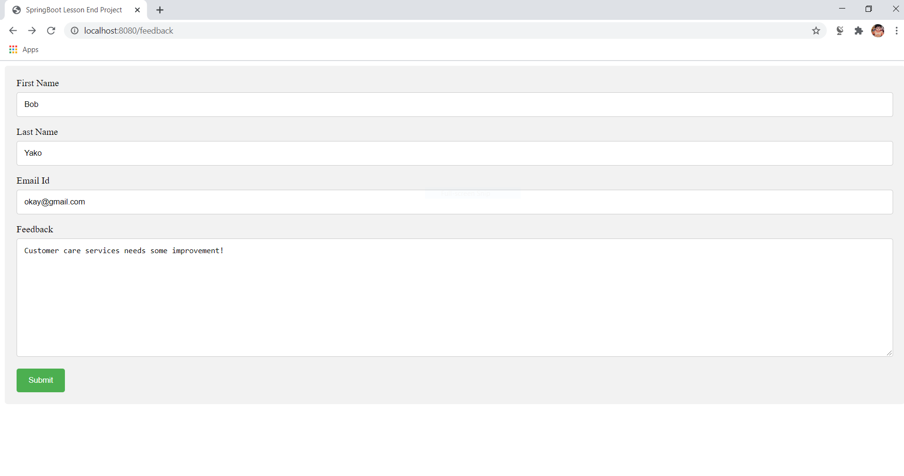
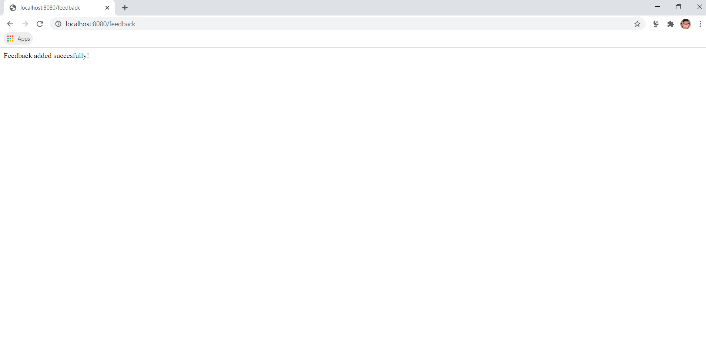
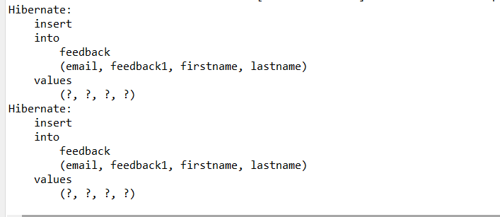
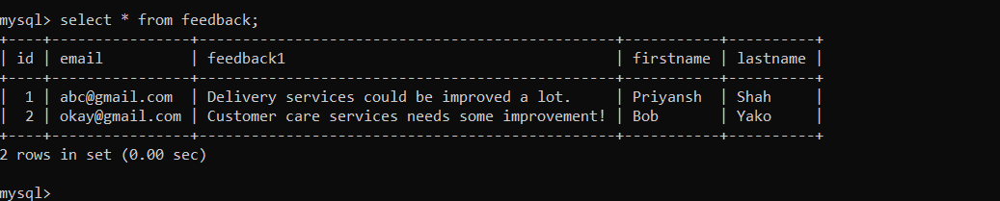

# SpringBootProject

* It is a Spring Boot project that will capture user feedback using a REST endpoint & the REST resource will take in parameters using HTTP POST. The feedback data will be then added to a database table.
* As a part of developing an ecommerce web application, a REST resource is needed to capture user feedback. Feedback data will be received from third-party apps and websites. The data will be sent to the REST API which will collect feedback from various sources.

### Softwares used:
* Eclipse as the IDE.
* Apache Tomcat as the web server.
* Spring Boot with Hibernate.

### Technologies used:
* Java 8
* Hibernate
* MySQL Database
* Spring-boot

### Steps:
* Created a MySQL table named feedback for storing feedback data.
* An entity class Feedback is made with annotations to link it with the feedback table.
* A repository class will then map the entity class to the CrudRepository interface.
* Created a REST controller class to create the REST endpoint. It takes in parameters using the POST protocol.
* Data received in the REST controller will be then saved into the database.
* Created a test form in HTML to submit data to the REST endpoint to ensure it’s working.

### Output

<kbd></kbd>

<kbd></kbd>

<kbd></kbd>

<kbd></kbd>
